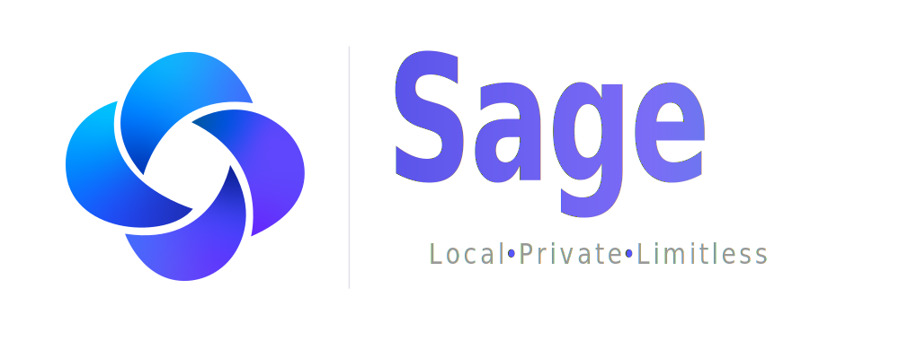

<div align="center">

  

  <p><em>An Offline-First Academic Assistant Using Retrieval Augmented Generation with Tool-Integrated Workflows</em></p>

  <p>
    <a href="https://github.com/ahmadrazacdx/Sage/actions/workflows/ci.yml"></a>
    <a href="https://codecov.io/gh/ahmadrazacdx/Sage"></a>
    <a href="https://github.com/ahmadrazacdx/Sage/releases/latest"></a>
    <a href="LICENSE.md"></a>
    
    
  </p>

  <p>
    <a href="#overview">Overview</a> ·
    <a href="#preview">Preview</a> ·
    <a href="#architecture">Architecture</a> ·
    <a href="#getting-started">Getting Started</a> ·
    <a href="#documentation">Documentation</a>
  </p>

</div>

---

## Overview

Sage is a desktop application that runs quantized LLMs locally via `llama.cpp` and orchestrates multiple specialized agentic workflows through LangGraph to handle academic tasks such as explanation, quiz generation, diagram creation, study planning, research, code diagnosis, and extended reasoning.

Everything runs on-device. No API keys, no cloud dependencies, no data leaves the machine.

### How It Works

The system manages two concurrent `llama-server` instances:

| Role | Model | Purpose |
| --- | --- | --- |
| **Primary** | Qwen3.5-2B (CPU) / Qwen3.5-4B (CUDA) | Generation, reasoning, structured output |
| **Utility** | Qwen3.5-0.8B | Memory extraction, history compression, auxiliary tasks |

User queries enter a LangGraph state graph where a router classifies intent and dispatches to the appropriate agent node. Each node has access to a hybrid RAG pipeline (dense retrieval via `BGE-small-en-v1.5` + sparse BM25, fused with Reciprocal Rank Fusion), a long-term semantic memory store, and a set of tools including sandboxed Python execution, web/arXiv/Wikipedia search, Mermaid diagram rendering, and PDF/Markdown export via Typst.

### Agent Modes

| Mode | Agent | What It Does |
|:---|:---|:---|
| Explain | `reasoning` | Chain-of-thought explanation with RAG context |
| Quiz Me | `quiz` | Generates and evaluates quizzes from course material |
| Diagram | `diagram` | Produces Mermaid diagrams with validation and SVG rendering |
| Study Plan | `planner` | Builds structured study roadmaps |
| Research | `research` | Multi-source wikipedia style research through (arXiv, web, Wikipedia) search with citations |
| Fix Code | `code_fix` | Code diagnosis and repair |
| Thinking | `reasoning` | Extended reasoning with configurable token budget |
| General | `general` | Open-ended conversation with memory |

## Preview

<table>
  <tr>
    <td width="50%" align="center">
      <!--  -->
      <br />
      <strong>Chat Interface</strong>
      <br />
      <sub>Placeholder — add screenshot</sub>
    </td>
    <td width="50%" align="center">
      <!--  -->
      <br />
      <strong>Diagram Generation</strong>
      <br />
      <sub>Placeholder — add screenshot</sub>
    </td>
  </tr>
  <tr>
    <td width="50%" align="center">
      <!--  -->
      <br />
      <strong>Research Mode</strong>
      <br />
      <sub>Placeholder — add screenshot</sub>
    </td>
    <td width="50%" align="center">
      <!--  -->
      <br />
      <strong>Quiz Generation</strong>
      <br />
      <sub>Placeholder — add screenshot</sub>
    </td>
  </tr>
</table>

## Architecture

```text
┌─────────────────────────────────────────────────────────┐
│                    pywebview Window                      │
│  ┌───────────────────────────────────────────────────┐  │
│  │            React / TypeScript SPA                 │  │
│  │         (Vite, SSE streaming, Mermaid)            │  │
│  └──────────────────────┬────────────────────────────┘  │
│                         │ HTTP / SSE                     │
│  ┌──────────────────────▼────────────────────────────┐  │
│  │              FastAPI Backend                       │  │
│  │         REST endpoints + SSE streaming             │  │
│  └──────────────────────┬────────────────────────────┘  │
│                         │                                │
│  ┌──────────────────────▼────────────────────────────┐  │
│  │         LangGraph Orchestration Layer             │  │
│  │  router → retrieval → agent node → response       │  │
│  └───────┬──────────┬──────────────┬─────────────────┘  │
│          │          │              │                      │
│  ┌───────▼───┐ ┌────▼─────┐ ┌─────▼──────┐              │
│  │  Hybrid   │ │ Semantic │ │   Tools    │              │
│  │   RAG     │ │  Memory  │ │ sandbox,   │              │
│  │ ChromaDB  │ │  SQLite  │ │ search,    │              │
│  │ + BM25    │ │          │ │ export     │              │
│  └───────────┘ └──────────┘ └────────────┘              │
│                                                          │
│  ┌──────────────────────────────────────────────────┐   │
│  │            llama-server (Primary + Utility)       │   │
│  │           Qwen3.5 GGUF · llama.cpp                │   │
│  └──────────────────────────────────────────────────┘   │
└─────────────────────────────────────────────────────────┘
```

## Tech Stack

| Layer | Technology |
| --- | --- |
| LLM Inference | `llama.cpp` (`llama-server`), Qwen3.5 GGUF models |
| Orchestration | `LangGraph`, `LangChain` |
| Backend | `FastAPI`, `Uvicorn`, `Pydantic`, `SQLite` (WAL), `ChromaDB` |
| Embeddings | `BGE-small-en-v1.5` (ONNX via `FastEmbed`) |
| Frontend | `React` 18, `TypeScript`, `Vite`, `Tailwind CSS` |
| Desktop Shell |  `pywebview`, `pystray` |
| Code Sandbox | Subprocess isolation with `NumPy`, `Pandas`, `SciPy`, `SymPy`, `Matplotlib`, `scikit-learn` |
| Export | `Typst` (PDF), Markdown |
| Search | `DuckDuckGo`, arXiv, Wikipedia |
| Build & CI | `uv`, `pnpm`, `Ruff`, `Mypy`, `pytest`, GitHub Actions |
| Installer | `NSIS`, `PowerShell` (`build.ps1`) |
| Release | GitHub Releases, Cloudflare R2 CDN |

## Getting Started

### Prerequisites

- Python 3.12
- Node.js 18+ and `pnpm`
- Windows 10/11
- 8 GB RAM minimum (16 GB recommended)

### Install

```bash
git clone https://github.com/ahmadrazacdx/Sage.git
cd Sage

# Python dependencies
uv sync --all-extras

# Frontend
cd frontend/artifacts/sage
pnpm install
pnpm dev
pnpm build
```

### Run

```bash
# Desktop mode (pywebview window)
python -m sage

# API/headless mode (for development)
python -m sage --dev
```

## Repository Structure

```text
📁Sage/
├── 📂src/sage/               # Core Python package
│   ├── 📂agents/             # LangGraph agent nodes (router, reasoning, quiz, diagram, ...)
│   ├── 📂rag/                # Hybrid retrieval pipeline (ChromaDB + BM25 + RRF)
│   ├── 📂routers/            # FastAPI route handlers (chat, sessions, documents, system)
│   ├── 📂tools/              # Sandboxed execution, search, export, calculator
│   ├── 📄llm.py              # llama-server subprocess management
│   ├── 📄memory.py           # Semantic memory extraction and retrieval
│   ├── 📄database.py         # SQLite persistence layer
│   ├── 📄config.py           # Pydantic settings + TOML loader
│   ├── 📄app.py              # FastAPI application factory
│   └── 📄desktop.py          # pywebview + system tray integration
├── 📂frontend/               # pnpm monorepo
│   └── 📂artifacts/sage/     # React SPA (Vite, TypeScript, Tailwind)
├── 📂config/                 # TOML configuration files
├── 📂docs/                   # Technical documentation
├── 📂tests/                  # pytest suite (30 modules, 80%+ coverage)
├── 📂scripts/                # Model download, ingestion, benchmarking
├── 📂installer/              # NSIS scripts, build manifest, staging
├── 📂assets/                 # Logo and static assets
├── 📂.github/workflows/      # CI, release, build-test, security
├── 📄pyproject.toml          # Project metadata and tool configuration
└── 📄build.ps1               # End-to-end installer build script
```

## Documentation

| Document | Description |
| --- | --- |
| [Architecture](docs/ARCHITECTURE.md) | System layers, agent nodes, data flow, inference strategy |
| [Setup Guide](docs/SETUP.md) | Environment setup, model downloads, server binaries |
| [API Reference](docs/API.md) | REST endpoints and SSE streaming contract |
| [Deployment](docs/DEPLOYMENT.md) | Build pipeline, NSIS packaging, CI/CD |
| [Institution Guide](docs/INSTITUTION_GUIDE.md) | Customizing Sage for a specific institution/ department |

<div align="center">
  <sub>BS Software Engineering · Final Year Project</sub>
  <br />
  <sub><a href="https://tu.edu.pk">Thal University Bhakkar</a> · Department of Computer Science & Information Technology</sub>
  <br />
  <sub>Built by <a href="https://github.com/ahmadrazacdx">Ahmad Raza</a> and <a href="https://github.com/abdullahkhan001">Abdullah Khan</a></sub>
</div>
