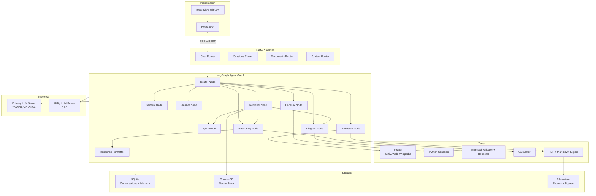

# Architecture

This document describes the internal architecture of Sage, covering the
component topology, data flow, agent orchestration, LLM lifecycle management,
RAG pipeline, persistence layer, and desktop integration.

---

## Table of Contents

- [System Overview](#system-overview)
- [Component Diagram](#component-diagram)
- [Agent Graph Topology](#agent-graph-topology)
- [LLM Lifecycle Management](#llm-lifecycle-management)
- [Hierarchical Model Strategy](#hierarchical-model-strategy)
- [RAG Pipeline](#rag-pipeline)
- [Memory and Persistence](#memory-and-persistence)
- [Database Schema](#database-schema)
- [Network Monitoring](#network-monitoring)
- [Desktop Integration](#desktop-integration)
- [Frontend Architecture](#frontend-architecture)
- [Configuration System](#configuration-system)

---

## System Overview

Sage is structured as a layered system:

1. **Presentation Layer**: React SPA served via FastAPI static mount, or
   rendered inside a pywebview native window.
2. **API Layer**: FastAPI application with REST endpoints and Server-Sent Events
   (SSE) for real-time streaming.
3. **Orchestration Layer**: LangGraph state graph that routes user queries to
   specialized agent nodes.
4. **Inference Layer**: llama-server processes (primary and utility) managed as
   subprocesses with health-check polling.
5. **Storage Layer**: SQLite for conversations and memory, ChromaDB for vector
   storage, filesystem for exports.

## Component Diagram



## Agent Graph Topology

The agent graph is assembled in `src/sage/agents/graph.py` using LangGraph's
`StateGraph`. Each node is a Python async function that receives the shared
`AgentState` (a TypedDict) and returns a partial state update.

### Node Definitions

| Node | Module | Input State Keys | Output State Keys |
| --- | --- | --- | --- |
| `router` | `router.py` | `query`, `mode` | `intent` |
| `retrieval` | `retrieval.py` | `query`, `intent`, `course_code` | `knowledge_units` |
| `general` | `general.py` | `query`, `student_memory` | `response` |
| `reasoning` | `reasoning.py` | `query`, `knowledge_units`, `student_memory` | `response` |
| `quiz` | `quiz.py` | `query`, `knowledge_units`, `student_memory` | `response`, `last_quiz_questions` |
| `diagram` | `diagram.py` | `query`, `knowledge_units` | `response`, `diagrams` |
| `planner` | `planner.py` | `query`, `student_memory` | `response` |
| `research` | `research.py` | `query`, `online_mode` | `response`, `artifact_paths` |
| `code_fix` | `code_fix.py` | `query` | `response` |
| `response_generator` | `response.py` | `response`, `knowledge_units` | `response` |

### Edge Routing

```text
START --> router

router --(intent)--> retrieval    [explain, quiz, diagram]
router --(intent)--> general      [general]
router --(intent)--> reasoning    [reasoning]
router --(intent)--> planner      [roadmap]
router --(intent)--> research     [research]
router --(intent)--> code_fix     [fix]

retrieval --(intent)--> reasoning [explain]
retrieval --(intent)--> quiz      [quiz]
retrieval --(intent)--> diagram   [diagram]

reasoning --(intent)--> response_generator [explain]
reasoning -----------------------> END     [thinking]

general ---------> END
quiz ------------> END
diagram ---------> END
planner ---------> END
research --------> END
code_fix --------> END
response_generator -> END
```

### Error Boundaries

Every node is wrapped with `with_error_boundary()`, which catches exceptions and
returns a safe fallback response containing the error message. This ensures that
a failure in any single node does not crash the entire graph execution.

## LLM Lifecycle Management

The LLM subsystem is implemented in `src/sage/llm.py` and manages two
llama-server processes: primary and utility.

### Startup Sequence

1. **Hardware detection**: Probe for CUDA, Vulkan, or CPU-only backend. Select
   the appropriate server binary and model file.
2. **Context window sizing**: Compute the maximum context window that fits in
   available memory, accounting for KV-cache quantization (`q4_k_m`).
3. **Server launch**: Start the llama-server subprocess on an available port with
   computed parameters (`--n-gpu-layers`, `--ctx-size`, `--cache-type-k`,
   `--cache-type-v`).
4. **Health polling**: Poll the server's `/health` endpoint until it reports
   ready, with configurable timeout.
5. **Utility server**: Start a second server for the `0.8B` utility model on a
   separate port, with a reduced context window.
6. **Client creation**: Instantiate `ChatOpenAI` clients pointed at the local
   servers.

### Shutdown

Both server processes are terminated on application shutdown via the FastAPI
lifespan context manager. Registered `atexit` handlers provide a safety net for
ungraceful exits.

### Port Allocation

Ports are allocated dynamically. The system scans from a base port (default 8080)
upward until an available port is found, preventing conflicts with other local
services.

## Hierarchical Model Strategy

Sage uses two models concurrently:

| Model | Parameters | Role | Context Window |
| --- | --- | --- | --- |
| Primary (CPU) | 2B (Qwen3.5-2B-Q4_K_M) | Reasoning, generation, complex output | Auto-scaled |
| Primary (CUDA) | 4B (Qwen3.5-4B-Q4_K_M) | Reasoning, generation, complex output | Auto-scaled |
| Utility | 0.8B (Qwen3.5-0.8B-Q4_K_M) | Memory, compression, structured extraction | 2500 tokens |

On CPU-only builds, the utility model is passed to agent nodes as `util_llm`.
Each node uses it for structured extraction steps (diagnosis, analysis,
description, evaluation, digest) while the primary model handles all generation
and reasoning. On CUDA builds, the utility model is not passed to agent nodes,
and the primary model handles all steps.

The memory subsystem (fact extraction, history compression, title generation)
always uses the utility model regardless of hardware backend.

## RAG Pipeline

The retrieval-augmented generation pipeline is implemented across
`src/sage/rag/`, `src/sage/agents/retrieval.py`, and `src/sage/embedding.py`.

### Indexing

1. Documents are chunked using a recursive text splitter (512 tokens, 64-token
   overlap).
2. Each chunk is embedded using BGE-small-en-v1.5 (384-dimensional dense
   vectors).
3. Chunks are stored in ChromaDB with metadata (source file, course code, chunk
   index).

### Retrieval

The retrieval node performs hybrid search:

1. **Dense retrieval**: Cosine similarity search against ChromaDB embeddings.
2. **Sparse retrieval**: BM25 keyword matching over chunk text.
3. **Reciprocal Rank Fusion (RRF)**: Merged ranking with a configurable
   `rrf_k_constant` (default 60).
4. **Top-K selection**: Returns the top K results (default 5) as structured
   `knowledge_units`.

Two separate collections are maintained: `curriculum` for institutionally
ingested materials and `user_uploads` for student-uploaded documents.

## Memory and Persistence

### Semantic Memory

The memory system (`src/sage/memory.py`) maintains long-term facts about
students across sessions:

1. **Extraction**: After each conversation turn, the utility model extracts
   structured facts in three categories: `identity`, `study`, `preference`.
2. **Quality gate**: Only facts that are specific, student-revealed, and useful
   beyond the current session are retained.
3. **Deduplication**: New facts are compared against existing memories using
   full-text search scoring. Duplicates are merged by timestamp refresh.
4. **Injection**: At query time, relevant memories are retrieved via FTS and
   injected into the system prompt as contextual background.

### History Compression

When conversation history exceeds the token budget, older messages are
summarized into a single system message using the utility model. The most recent
turns (configurable, default 6) are preserved verbatim.

### State Checkpointing

LangGraph's `AsyncSqliteSaver` provides automatic state persistence. Each graph
invocation with a `thread_id` saves and restores the full agent state, enabling
conversation continuity across application restarts.

## Database Schema

SQLite is the sole relational store, accessed via `src/sage/database.py` with
asynchronous I/O through aiosqlite.

### Tables

| Table | Purpose | Key Columns |
| --- | --- | --- |
| `conversations` | Conversation metadata | `id`, `title`, `last_message`, `message_count`, `updated_at` |
| `memories` | Long-term student facts | `id`, `content`, `category`, `confidence`, `created_at`, `updated_at` |

WAL (Write-Ahead Logging) mode is enabled by default for concurrent read/write
performance.

## Network Monitoring

The `NetworkMonitor` class (`src/sage/network.py`) runs a background task that
periodically probes external connectivity. Its state is exposed to the frontend
via the `/api/status` endpoint and controls whether online tools (arXiv, web
search, Wikipedia) are available to the research agent.

The `[network].force_offline` configuration flag overrides the probe and forces
all online tools to be disabled, which is the recommended setting for
air-gapped deployments.

## Desktop Integration

The desktop layer (`src/sage/desktop.py`) provides:

- **pywebview window**: Renders the React SPA in the system's native webview
  engine, eliminating the need for a separate browser.
- **System tray**: Background operation with tray icon and context menu
  (show/hide window, quit).
- **Startup orchestration**: Coordinates the FastAPI server, LLM server, and
  webview window lifecycle.

The application can also run in browser mode (`--browser`) or headless backend
mode (`--dev`) for development.

## Frontend Architecture

The frontend is a React single-page application built with Vite and TypeScript.
It is organized as a pnpm monorepo under `frontend/`:

| Package | Purpose |
| --- | --- |
| `artifacts/sage` | Main Vite application |
| `lib/api-client-react` | React hooks and context for API communication |
| `lib/api-spec` | OpenAPI specification |
| `lib/api-zod` | Zod schemas for runtime validation |
| `lib/db` | Client-side database utilities |

Communication with the backend uses:

- **REST** (`POST /api/chat`, `GET /api/sessions`) for request submission and
  data retrieval.
- **SSE** (`GET /api/stream/{thread_id}`) for real-time streaming of agent
  progress, tool calls, and response chunks.

## Configuration System

Configuration is managed by Pydantic settings models in `src/sage/config.py`,
loaded from TOML files with environment variable overrides.

### Runtime-Computed Fields

Several fields are computed at startup and not present in TOML:

- `llm.active_context_size`: Determined by hardware probing
- `llm.active_model_name`: Selected based on CUDA availability
- `llm.active_parallel_slots`: Computed from available resources

All settings are validated at load time via Pydantic, and invalid configurations
produce clear error messages rather than silent failures.
