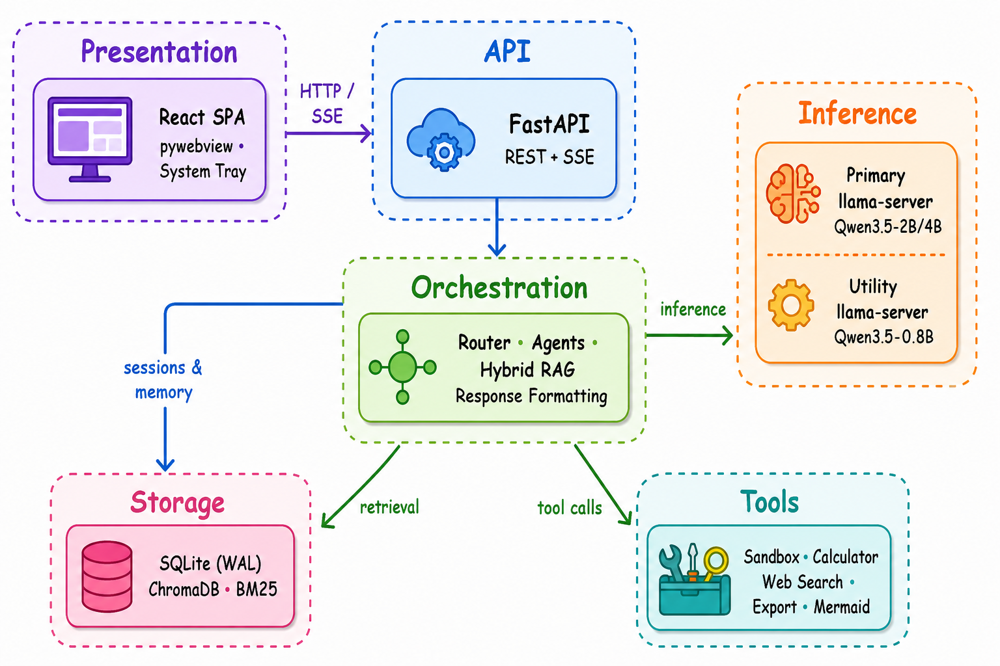
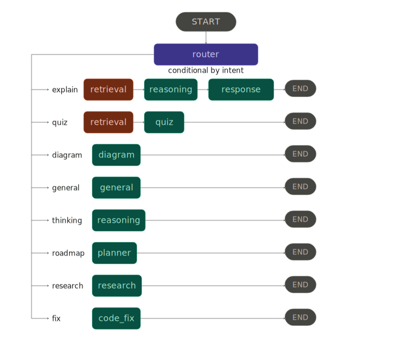

# Architecture

> Internal architecture reference for the Sage desktop application.

## System Overview

Sage is structured as five layers, each with a single responsibility:

| Layer | Component | Responsibility |
| --- | --- | --- |
| **Presentation** | React SPA (Vite, TypeScript, Tailwind CSS) | Renders the chat interface inside a `pywebview` native window |
| **API** | FastAPI + Uvicorn | REST endpoints, SSE streaming, static file serving |
| **Orchestration** | LangGraph `StateGraph` | Intent routing, agent node dispatch, error boundaries |
| **Inference** | `llama-server` subprocesses | GGUF model loading, token generation, health monitoring |
| **Storage** | SQLite (WAL) + ChromaDB | Conversations, semantic memory, vector indices |

## Layer Diagram

<div align="center">
  
</div>

## Inference Layer

Sage manages two concurrent `llama-server` instances as child processes. Each runs as an OpenAI-compatible HTTP server on a dynamically allocated loopback port.

### Primary Model

| Attribute | CPU Build | CUDA Build |
| --- | --- | --- |
| Model | Qwen3.5-2B (Q4_K_M) | Qwen3.5-4B (Q4_K_M) |
| Context window | Auto-scaled by available RAM (3K–32K) | Auto-scaled by VRAM (3K–64K) |
| GPU layers | 0 | Auto (partial or full offload by VRAM) |
| KV cache quantization | `q4_0` (K and V) | `q4_0` (K and V) |
| Parallel slots | 4 (continuous batching) | 1 |

### Utility Model

| Attribute | Value |
| --- | --- |
| Model | Qwen3.5-0.8B (Q4_K_M) |
| Context window | 4096 tokens (configurable) |
| Backend | Always CPU |
| Purpose | Memory extraction, history compression, title generation, auxiliary structured output |

### Hardware Auto-Detection

On startup, `llm.py` performs the following resolution sequence:

1. **GPU Probe:** Calls `nvidia-smi` to detect CUDA GPUs and available VRAM.
2. **Binary Selection:** Selects CUDA or CPU `llama-server` binary. Falls back to CPU if the CUDA installation is incomplete (missing DLLs).
3. **Context Scaling** Determines context window size from available RAM (CPU) or VRAM (GPU) using tiered thresholds.
4. **GPU Layer Offload** Resolves `--n-gpu-layers` based on VRAM (full offload ≥ 4 GB, partial at ≥ 2 GB).
5. **Thread Allocation** Sets generation and batch thread counts from physical core count, with hybrid CPU topology detection.
6. **Orphan Cleanup:** Kills any stale `llama-server` processes from previous runs.
7. **Health Poll:** Blocks until `/health` returns 200 or the timeout expires.
8. **JIT Warmup:** Sends a single-token completion to trigger GGML graph compilation.

### Process Lifecycle

- Teardown is registered via both `atexit` and `SIGTERM` handlers.
- A background stderr drain thread prevents Windows pipe buffer deadlocks during model loading.
- The primary and utility servers are independent processes on separate ports.

## Orchestration Layer

The orchestration layer is a LangGraph `StateGraph` compiled in `agents/graph.py`. All state is passed through a single typed dict (`AgentState`).

### Graph Topology

<div align="center">
  
</div>

### Agent Nodes

| Node | Module | Description |
| --- | --- | --- |
| `router` | `agents/router.py` | Classifies user intent via LLM structured output |
| `retrieval` | `agents/retrieval.py` | Executes hybrid RAG (dense + sparse + RRF) |
| `general` | `agents/general.py` | Open-ended conversation with memory context |
| `reasoning` | `agents/reasoning.py` | Chain-of-thought explanation with optional thinking mode |
| `quiz` | `agents/quiz.py` | Generates and evaluates quizzes from retrieved material |
| `diagram` | `agents/diagram.py` | Mermaid diagram generation with syntax validation and SVG rendering |
| `planner` | `agents/planner.py` | Structured study roadmap generation |
| `research` | `agents/research.py` | Multi-source search (arXiv, web, Wikipedia) with digest and PDF export |
| `code_fix` | `agents/code_fix.py` | Code diagnosis, repair, and explanation |
| `response_generator` | `agents/response.py` | Citation formatting for explain-mode responses |

### Error Handling

Every node is wrapped with `with_error_boundary` (defined in `utils.py`). If a node raises an exception, the boundary catches it and injects a fallback error response into `AgentState`, preventing graph-level failures from surfacing as unhandled crashes.

### Tools

Agent nodes invoke tools through LangChain's tool interface:

| Tool | Module | Description |
| --- | --- | --- |
| `execute_python` | `tools/sandbox.py` | Sandboxed subprocess execution with NumPy, Pandas, SciPy, SymPy, Matplotlib, scikit-learn |
| `calculator` | `tools/calculator.py` | Mathematical expression evaluation |
| `search_web` | `tools/search.py` | DuckDuckGo web search |
| `search_arxiv` | `tools/search.py` | arXiv paper search |
| `search_wikipedia` | `tools/search.py` | Wikipedia article search |
| `export_pdf` | `tools/export.py` | PDF report generation via Typst |
| `export_markdown` | `tools/export.py` | Markdown file export |

## Retrieval-Augmented Generation

The RAG pipeline is implemented in `rag/` and combines dense and sparse retrieval:

### Indexing

1. Documents are chunked at 512 tokens with 64-token overlap.
2. Chunks are embedded using `BGE-small-en-v1.5` (ONNX via FastEmbed).
3. Vectors and metadata are stored in ChromaDB with separate collections for curriculum and user uploads.

### Retrieval

1. **Dense retrieval** — Cosine similarity search against ChromaDB embeddings.
2. **Sparse retrieval** — BM25 scoring via `rank-bm25` over the same chunk corpus.
3. **Fusion** — Results from both retrievers are merged using Reciprocal Rank Fusion (RRF) with a configurable `k` constant (default: 60).
4. **Top-K selection** — The fused ranking is truncated to `top_k` results (default: 5).

### Document Support

Ingestion (`scripts/ingest.py`) supports: `.pdf`, `.docx`, `.pptx`, `.md`, `.txt`.

## State and Persistence

### Conversations

- Stored in SQLite with WAL mode enabled for concurrent read/write access.
- LangGraph's `AsyncSqliteSaver` manages graph state checkpointing per `thread_id`.
- Each conversation tracks metadata (title, last message preview, message count, timestamps).

### Vector Store

- ChromaDB manages two collections: `curriculum` (pre-ingested course material) and `user_uploads` (runtime document uploads).
- Persisted to disk at `artifacts/data/databases/vectordb/`.

## Semantic Memory

The memory subsystem (`memory.py`) provides cross-session context:

1. **Extraction:** After each conversation turn, the utility model extracts facts categorized as `identity`, `study`, or `preference`.
2. **Deduplication:** New facts are compared against existing entries using full-text search. Facts exceeding a similarity threshold (default: 0.88) are rejected as duplicates.
3. **Injection:** On each new query, relevant facts are retrieved by keyword search and injected into the system prompt.
4. **History Compression:** After a configurable number of turns (default: 6), the utility model summarizes old messages into a compact summary, which replaces the raw history in the graph state.

## Desktop Integration

The native Windows application is managed by `desktop.py`:

- **pywebview** renders the React SPA in a native window (no Electron, no browser dependency).
- **pystray** provides a system tray icon with minimize/restore/quit controls.
- The FastAPI server, both `llama-server` instances, and the webview window are coordinated in a single process tree.
- Window lifecycle events (close, minimize) are handled to keep the tray icon and backend alive when the window is dismissed.

## Configuration System

Settings are managed via Pydantic models validated against TOML files `config/default.toml` and `config/institution.toml`.

### Configuration Sections

| Section | Pydantic Model | Key Parameters |
| --- | --- | --- |
| `[app]` | `AppSettings` | `name`, `data_dir`, `log_level`, `desktop_mode` |
| `[llm]` | `LLMSettings` | Model paths, GPU layers, context window, temperature, thinking mode |
| `[embedding]` | `EmbeddingSettings` | Embedding model path |
| `[rag]` | `RAGSettings` | Collections, chunk size/overlap, top-k, RRF constant |
| `[database]` | `DatabaseSettings` | SQLite path, WAL mode |
| `[agent]` | `AgentSettings` | Token limits, timeouts, retry counts |
| `[memory]` | `MemorySettings` | Max memories, dedup threshold, compression trigger |
| `[tools.*]` | `ToolsSettings` | Sandbox timeout, search timeouts, export paths, Mermaid binary |
| `[corpus]` | `CorpusSettings` | Max user documents, allowed file extensions |
| `[network]` | `NetworkSettings` | `force_offline`, check interval, timeout |
| `[ui]` | `UISettings` | Host, port, auto-open browser |
| `[institution]` | `InstitutionSettings` | Institution name, department, programs, social links |

All settings are loaded once at startup via `get_settings()` (LRU-cached singleton). Hardware-dependent parameters (context window, GPU layers, active model path) are resolved dynamically during LLM server initialization.

## Import Layering

The codebase enforces strict import boundaries, verified by CI (`architecture-check` job):

```text
tools/  - Cannot import from agents/ or rag/
rag/    - Cannot import from agents/
agents/ - May import from rag/ and tools/
```

This prevents circular dependencies and ensures each layer can be tested in isolation.
